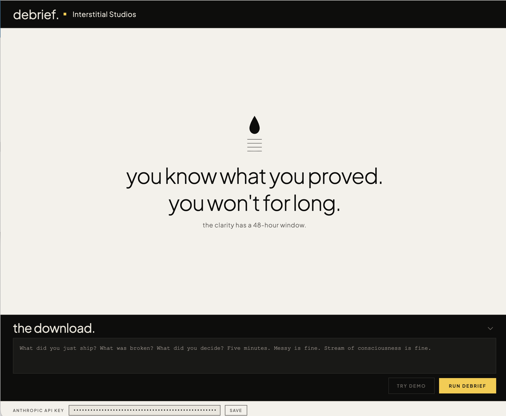
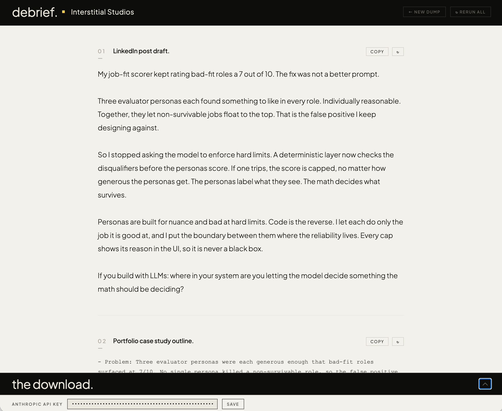
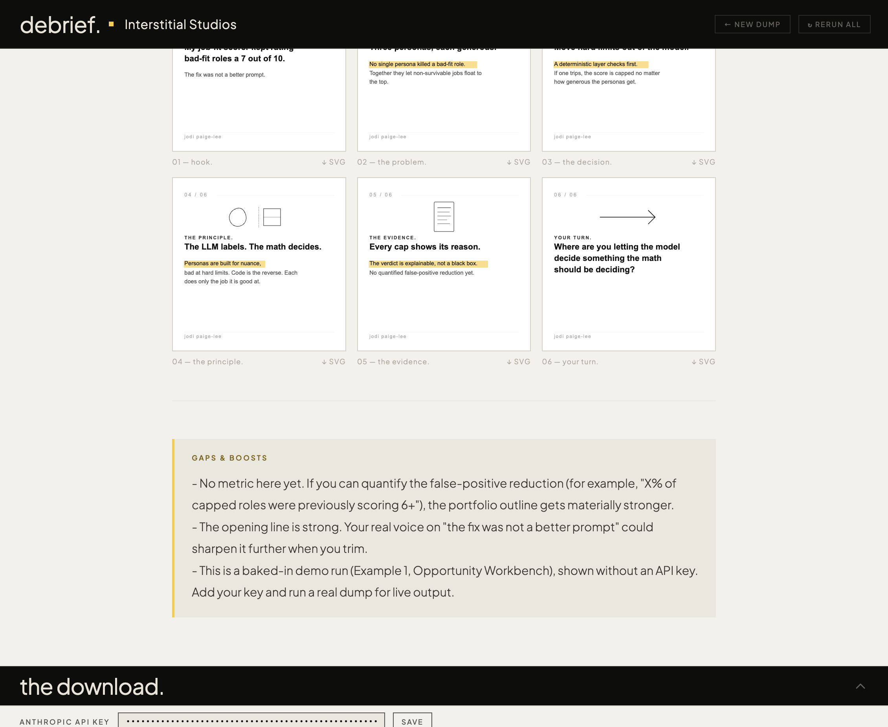

# Build Debrief Specialist

  
  
  
  

I design how AI systems behave and decide, not just how they look. This one decides what is worth saying about the work, before I forget I knew.

**Try it live:** [jmarielee.github.io/debrief-specialist](https://jmarielee.github.io/debrief-specialist/). Click **Try demo**, no API key needed, to watch a real run end to end.

**Verify it yourself, in just a few minutes.** 

1. **The NDA firewall held.** Search the whole tree and the full commit history
   for any client name. There is none. Run `git log -p | grep -i <any client name>`
   against the history and it comes back empty. The real protected names live only
   in a gitignored local file that was never committed, so the firewall never had
   the thing it protects in the repo to begin with.
2. **It anonymizes on its own.** In the live demo, the input dump names a client.
   The outputs say "a real-estate brokerage." I never told it to hide that. It did,
   and flagged that it did.
3. **The math decides, not the model.** Under the LinkedIn draft, a publish gate
   runs in code: it checks for em-dashes, links, a number not in the dump, a leaked
   name, and throat-clearing. The model writes. Code rules it publish-ready or not.
4. **Watch it fail on purpose.** The trap name "Northwind Realty" trips the gate
   live, so you can see the refusal happen, not just read that it exists.
5. **It never asserts what it cannot back up.** No fabricated metric, anywhere. If
   the dump has no number, the output has no number, and the gap is flagged.

**For reviewers:** read [`brief.md`](./brief.md) first. One painful problem, scoped to exactly five outputs, nothing more. The judgment to notice is the scoping: what I refused to add is as deliberate as what I built.

The approach here, the model labels and the math decides, is one I have been publishing and building on since Competition 7.

> **Capstone submission, Month 2.** This week the builder is the client. The brief at the top of this repo ([`brief.md`](./brief.md)) is one I wrote for myself. This folder is the system that solves it.

---

## The problem, in one line

I finish a build session knowing exactly what I just proved, and 48 hours later that clarity is gone, because I keep it in my head and memory degrades. (Full diagnosis in [`brief.md`](./brief.md).)

## What this folder does

It accepts a 5-minute unstructured brain dump (messy, stream-of-consciousness, typed or voice-to-text) immediately after I ship something. It returns five artifacts, every session, same response:

1. **A LinkedIn post draft.** A near-finished post I trim, not a brief I build from. Claim-first, teaches one thing, written in my voice.
2. **A portfolio case study outline.** Six parts (problem, decision, constraint, system behavior, evidence, outcome), ready to expand into a full case study.
3. **A resume-ready sentence.** One line, drop-in.
4. **A pitch sentence.** What this build proves about how I think.
5. **Six carousel SVGs.** Because the thinking is already structured, turning it into a LinkedIn carousel costs almost nothing — so the specialist does that too. Six 1080×1080px SVG files, one per slide, design system locked: white background, black illustrations, yellow text highlight. Drag into Figma or Illustrator, adjust any text reflow, export as PDF, upload to LinkedIn as a swipeable carousel. SVG files load Plus Jakarta Sans from Google Fonts in a browser; for Figma or offline use, install the font locally first.

The point is not to make me post more. It is to make the *proof of my thinking* nearly free to capture while it is still alive, because the gap between what I build and what the market can see me build is the thing standing between me and the next role.

---

## How it works

The design follows one principle that comes straight from the problem: **structuring has to happen inside the capture, not after.** A notes app captures the dump and leaves it raw. Raw is useless three days later. So this system does not tidy the dump. It transforms it into five finished structures in a single pass.

| File | Role |
|------|------|
| [`brief.md`](./brief.md) | The client brief. The problem, treated like a real client engagement. |
| [`identity.md`](./identity.md) | Who the specialist is and what it understands about my practice. |
| [`rules.md`](./rules.md) | The operating contract. Five outputs every time, plus the hard rules. |
| [`examples.md`](./examples.md) | Four real builds run through the system, input to output. |
| [`reference/`](./reference/) | Vocabulary bank, voice guide, output templates, and my real voice samples. |

---

## The design decisions worth noticing

This is the part that makes it a case study and not a prompt.

**1. It finds the behavioral decision first.** Before writing anything, the specialist locates the architectural or behavioral choice inside the dump and makes it the lead, because in my practice the decision is the asset, not the feature. (`rules.md`, Rule 1.)

**2. It refuses to fabricate metrics, or to let unshipped work read as shipped.** If I did not give it a number, it does not invent one. A made-up "improved efficiency 40%" would betray the exact principle my work is built on: the math has to be real. The same honesty covers capability claims. Building in public is encouraged, but in-progress work has to stay legibly in-progress, especially in the one-line resume and pitch outputs that travel without context. When there is no number, it leads with the behavioral insight and flags where a real metric would strengthen the artifact. (`rules.md`, Rule 4.)

**3. It anonymizes protected client names automatically.** Prior client work must stay anonymized in any public-facing output. The specialist strips protected names from every output without being asked, and flags that it did. The protected names live in a local-only file that is gitignored and never committed, so the guardrail never surfaces the thing it exists to protect. (`rules.md`, Rule 5; see Example 3.)

**4. It tells me where I am needed.** Every run ends with a short *Gaps & Boosts* section: the 2 to 4 places where five more minutes of my input most improves the set. The system is honest about its own limits instead of papering over them. (`rules.md`, Rule 6.)

**5. It is honest about how it learns.** The folder does not learn on its own. The model has no memory between sessions, and these files do not edit themselves. What is real is a manual loop: I trim a draft into the post I publish, then paste that published version into `reference/voice-samples.md`. Each real sample pulls the next draft closer to my voice. A folder that claimed to learn automatically would be asserting something it cannot back up, which is the thing my whole practice is built against. So it does not claim that. It earns the improvement honestly. (`reference/voice-samples.md`.)

**6. It is a continuity layer, not just a capture tool.** Because the specialist knows the established work and the angles already published, each new dump produces a post that advances the narrative rather than restarts it. The reader who saw the first post learns something new in the second. That accumulation is how a body of work becomes legible over time, not just a collection of individual updates.

**7. It checks its own work, and it is honest about how.** After the five outputs, a
publish gate runs seven checks on the LinkedIn draft: em-dash, external link, hashtag
count, a number not in the dump, a protected name, throat-clearing, and word count. The
two that are not LinkedIn rules but honesty rules, protected name and unbacked number,
also run on the resume and pitch lines, because those travel without context and a
recruiter reads them as finished fact. In the folder, the model runs these as a
self-check and reports. In the companion app, the identical checks run as deterministic
code, so the verdict holds whether or not the model cooperated. The folder self-checks.
The app enforces. That gap is the point: a "must" in a markdown file is a request, a
"must" in code is a constraint, and I built each at the layer where it is true. The model
labels. The math decides. This time pointed at the tool itself. (`rules.md`, Rule 8.)

Those decisions are the same kind of thinking I bring to every system I design: the model does what it is good at, deterministic rules enforce what it cannot be trusted with, and the boundary between them is where the reliability lives.

---

## How to use it

1. Finish a build. While it is still hot, talk or type for five minutes: what you did, what was broken, what you decided.
2. Drop the dump in with this folder as context.
3. Get five artifacts back. Trim the LinkedIn draft into your own voice. The other four are close to drop-in. The carousel SVGs are the exception: they need a Python-capable environment to generate and a design tool to finish. Take them into Figma, adjust any text reflow, export as PDF, and upload to LinkedIn as a swipeable carousel.
4. **Post on a Tuesday, Wednesday, or Thursday between 8 and 10 AM.** Stay online for 90 minutes after you publish. Reply to every substantive comment within 30 minutes. The algorithm shows your post to a small seed group first. Early engagement from that group is what unlocks wider distribution. If you post and walk away, that window closes.
5. Read the *Gaps & Boosts*. Spend five more minutes only where it pays.
6. When you publish the post, paste the final version into `reference/voice-samples.md`. The next draft comes back closer.

---

*Built by Jodi Paige-Lee, Intelligence Layer Designer, Interstitial Studios.*
